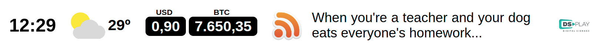

# DSPLAY - Horizontal Information Bar

This is a HTML-based template for [DSPLAY](https://dsplay.tv).

## Basics

> This project was bootstrapped with [DSPLAY - React Template Boilerplate](https://github.com/dsplay/template-boilerplate-react).

## Usage

This template has 5 widgets:

- Clock (local time)
- Weather (current weather for the provided lat and lon)
- Currency (currency conversion)
- News (RSS feed)
- Logo (A single image)

All widget are optional and will depend on the provided template variables.



### Configuration

This template has many configuration variables as the following table shows:

| Variable              | Widget   | Type    | Description                                                                                                                                                                       |
|-----------------------|----------|---------|-----------------------------------------------------------------------------------------------------------------------------------------------------------------------------------|
| `clock`               | Clock    | boolean | enables/disables the Clock widget                                                                                                                                                 |
| `weatherbit_api_key`  | Weather  | string  | In order to show weather forecast, you need a WeatherBit (https://www.weatherbit.io) API key. Leave it empty to hide the Weather widget.                                          |
| `latitude`            | Weather  | string  | Latitude of the place to get weather (ex: 41.1621376)                                                                                                                             |
| `longitude`           | Weather  | string  | Longitude of the place to get weather (ex: -8.656973)                                                                                                                             |
| `currency_api_key`    | Currency | string  | In order to show currency conversion, you need a CurrencyConverter (https://free.currencyconverterapi.com/free-api-key) free API key. Leave it empty to hide the Currency widget. |
| `source_currency_1`   | Currency | string  | First source currency to be converted. Possible values are: BRL,USD,EUR,GPB,CUP,AUD,CVE,CNY,INR,KRW,COP,IDR,NGN,RON,ZAR,VEF,CAD,CLP,JPY,CHF,AFN,EGP,RUB,UYU,BTC                   |
| `source_currency_2`   | Currency | string  | Second source currency to be converted. Possible values are: BRL,USD,EUR,GPB,CUP,AUD,CVE,CNY,INR,KRW,COP,IDR,NGN,RON,ZAR,VEF,CAD,CLP,JPY,CHF,AFN,EGP,RUB,UYU,BTC                  |
| `target_currency`     | Currency | string  | Target currency. Possible values are: BRL,USD,EUR,GPB,CUP,AUD,CVE,CNY,INR,KRW,COP,IDR,NGN,RON,ZAR,VEF,CAD,CLP,JPY,CHF,AFN,EGP,RUB,UYU,BTC                                         |
| `rss_url`             | RSS      | string  | RSS feed URL. Leave it empty to hide the News widget                                                                                                                              |
| `sponsor_logo`        | Logo     | image   | Logo to be shown in the bar. Leave it empty to hide the Logo widget.                                                                                                              |
| `widgetsSequenceQuery`            | All      | string | Put each initial character to order widgets, example: c, q, w, s, n
| `bg_color`            | All      | color   |                                                                                                                                                                                   |
| `bg_image`            | All      | image   |                                                                                                                                                                                   |
| `text_color`          | All      | color   |                                                                                                                                                                                   |
| `rss_logo_box_color`  | RSS      | color   |                                                                                                                                                                                   |
| `currency_box_color`  | Currency | color   |                                                                                                                                                                                   |
| `currency_text_color` | Currency | color   |                                                                                                                                                                                   |


## Customizing

### Getting started

```
git clone https://github.com/dsplay/template-horizontal-info-bar.git my-awesome-template
cd my-awesome-template
rm -rf .git
npm i
npm start
```

## Packing (release build)

To create a release build of the template, ready to be uploaded to DSPLAY, just run:

```
npm run zip
```

It will generate a `template.zip` file ready to be deployed to [DSPLAY Web Manager](https://manager.dsplay.tv/template/create)

## More

The see more about DSPLAY HTML Templates, visit: https://developers.dsplay.tv/docs/html-templates
```
